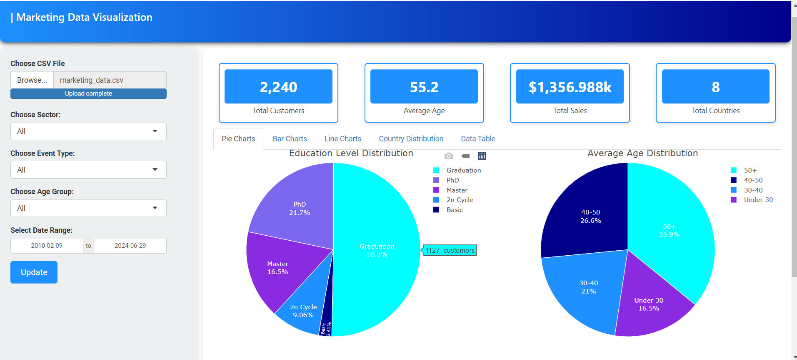
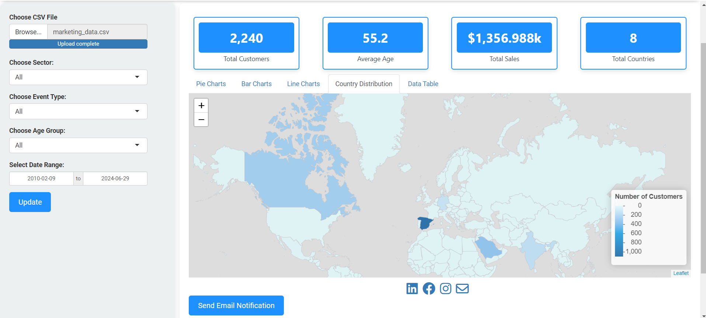

# Market Data Analysis

### Dashboard Overview


### Geographic Distribution


## Features

- **Data Upload**: Upload your own CSV files to analyze custom datasets.
- **Filters**: Filter data by sector, event type, age group, and date range.
- **KPI Cards**: View key performance indicators such as total customers, average age, total sales, and total countries.
- **Visualizations**: 
  - **Pie Charts**: Distribution of education levels and average age groups.
  - **Bar Charts**: Analysis of marital status and spending by product category.
  - **Line Charts**: Trends in sales and customer growth over time.
  - **Map**: Geographic distribution of customers.
- **Data Table**: Interactive table to view and filter detailed data.
- **Email Notifications**: Send email notifications with data updates or reports.


 The following R packages must be installed:

```r
install.packages(c("shiny", "ggplot2", "plotly", "dplyr", "readr", "leaflet", "sf", "rnaturalearth", "rnaturalearthdata", "lubridate", "tidyr", "shiny.fluent", "imola", "DT", "fontawesome", "blastula"))
