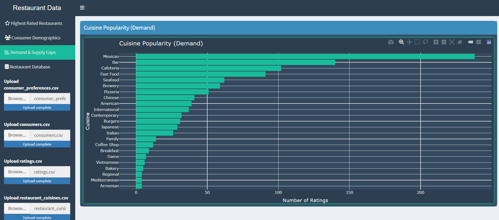

# Market Data Analysis

### Dashboard Overview


### Geographic Distribution


### Video 

<video width="320" height="240" controls>
  <source src="app_presentation.mp4" type="video/mp4">
  Your browser does not support the video tag.
</video>
### Demand Analysis


### Restaurant Locations


### Top Restaurants


### Age Distribution


## Features First Project

- **Data Upload**: Upload your own CSV files to analyze custom datasets.
- **Filters**: Filter data by sector, event type, age group, and date range.
- **KPI Cards**: View key performance indicators such as total customers, average age, total sales, and total countries.
- **Visualizations**: 
  - **Pie Charts**: Distribution of education levels and average age groups.
  - **Bar Charts**: Analysis of marital status and spending by product category.
  - **Line Charts**: Trends in sales and customer growth over time.
  - **Map**: Geographic distribution of customers.
- **Data Table**: Interactive table to view and filter detailed data.
- **Email Notifications**: Send email notifications with data updates or reports.
  
  # Second Project
  This Shiny app provides an interactive dashboard for visualizing restaurant data. 

1. **Highest Rated Restaurants**
Top 10 Highest Rated Restaurants: This tab displays a bar chart of the top 10 highest-rated restaurants based on average ratings. The ratings are aggregated from the uploaded ratings CSV file.
2. **Consumer Demographics**
Consumer Age Distribution: This tab features a pie chart showing the age distribution of consumers. The chart is generated from the uploaded consumers CSV file.
Cuisine Preferences by City in Mexico: This tab includes an interactive map created with Leaflet. The map displays the cuisine preferences of consumers in various cities in Mexico using circle markers. Each marker's size represents the number of consumers preferring a particular cuisine.
Alcohol Consumption by City: This tab presents a bar chart that visualizes alcohol consumption levels by city. The data is grouped by city and drink level.
3. **Demand & Supply**
Cuisine Popularity (Demand): This tab shows a bar chart indicating the popularity of different cuisines based on the number of ratings each cuisine received. The data is derived from the ratings and restaurant cuisines CSV files.
4. **Restaurant Database**
Restaurant Database: This tab provides a searchable and sortable table of all the restaurants. The table is interactive and includes options to copy, export to CSV, Excel, PDF, or print.
Restaurant Locations: This tab features an interactive map displaying the locations of all the restaurants using Leaflet. Each marker includes a popup with the restaurant's name and city.
The following R packages must be installed:

```r
install.packages(c("shiny", "ggplot2", "plotly", "dplyr", "readr", "leaflet", "sf", "rnaturalearth", "rnaturalearthdata", "lubridate", "tidyr", "shiny.fluent", "imola", "DT", "fontawesome", "blastula"))
